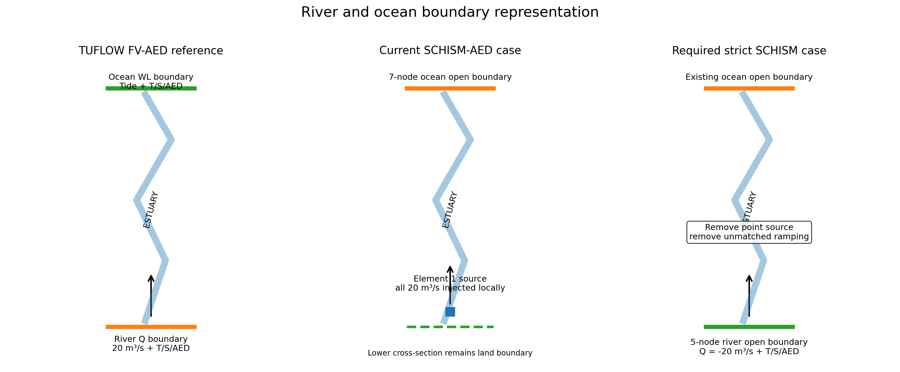
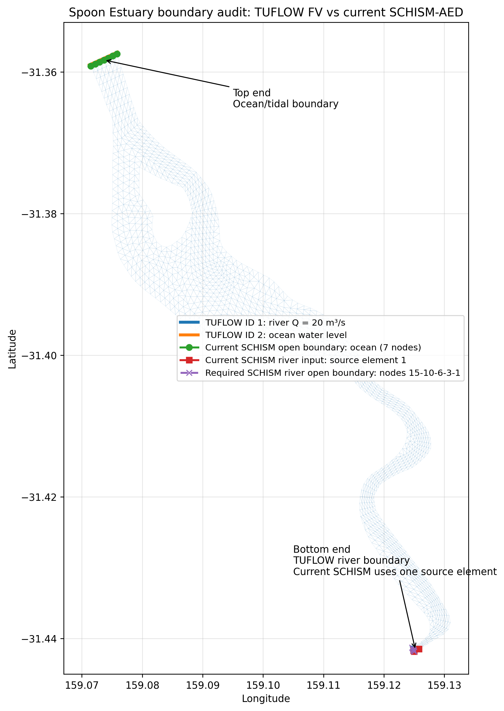
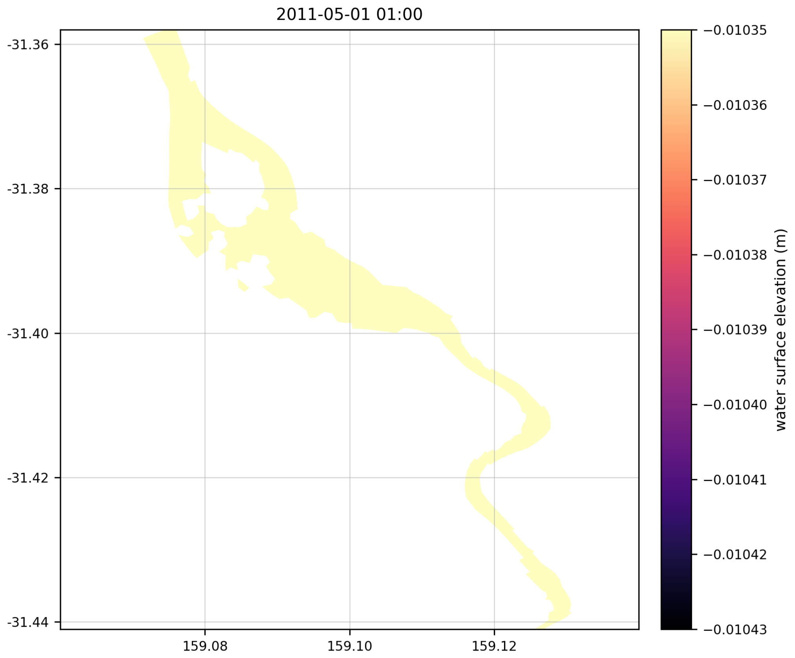
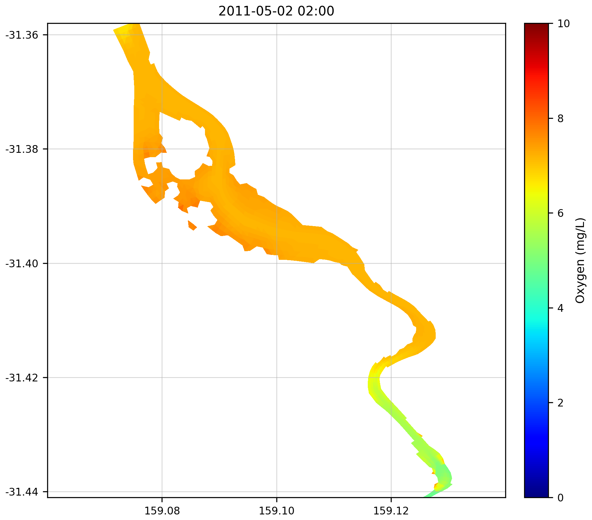
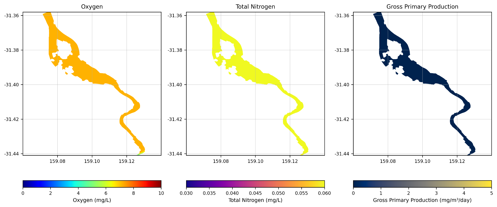
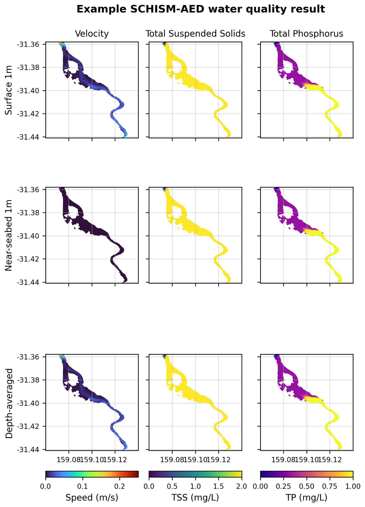

# Spoon Estuary: TUFLOW FV-AED and SCHISM-AED

## Setup comparison, boundary audit and preliminary SCHISM-AED results

**Prepared by:** Dongfang Liu  
**Version:** 1.0  
**Date:** 12 July 2026

> The river and ocean ends and all supplied forcing values are correct. The current SCHISM river inflow is an element source rather than the distributed TUFLOW Q boundary, so the results below are preliminary and should not yet be treated as a strict model-to-model comparison.

## 1. Setup comparison

| Component | TUFLOW FV-AED | Current SCHISM-AED | Implication |
|---|---|---|---|
| Horizontal grid | 1,419 vertices; 1,375 reported 2D cells | 1,419 nodes; 2,535 triangles | Common domain, different cell topology and variable locations |
| Vertical grid | TUFLOW z/sigma configuration, four sigma layers | Five sigma levels, four active layers | Compare common physical depth bands |
| Time step | Adaptive 0.1-30 s, CFL 0.6 | Fixed 60 s | Numerical phase and diffusion may differ |
| River | Distributed Q boundary, 20 m³/s | Source element 1, 20 m³/s | Critical current mismatch |
| Ocean | Water-level nodestring | Seven-node open boundary | Location and time series aligned |
| Startup | Direct series | 2-day elevation and 1-day source ramp | First days not identical |
| Output | Combined `HYD_aed.nc` | Variable/stack NetCDF files | Common post-processing required |

## 2. Boundary audit

Confirmed:

- lower/southern end = river;
- upper/northern end = ocean/tide;
- forcing values and hourly record times match;
- required SCHISM river open-boundary nodes = `15, 10, 6, 3, 1`;
- those nodes are currently part of the exterior land boundary.

Required strict-comparison correction:

1. create the five-node river open boundary;
2. prescribe `Q = -20 m³/s` with river T/S/AED values;
3. remove the point source and unmatched source ramp;
4. run flux and mass-balance checks;
5. rerun the six-day benchmark with 145 hourly records.

## 3. Preliminary SCHISM-AED results

### Water-surface elevation

### Oxygen with velocity vectors

### Oxygen, total nitrogen and gross primary production

### Surface, near-seabed and depth-averaged results

## 4. Publication approach

Keep code, text inputs, notebooks and selected figures in GitHub. Keep full model-output NetCDF files in an approved research-data archive and link them from the repository. Add the final SCHISM case to the existing Spoon Estuary multi-model repository after team review.
